# Comparação de Tecnologias de Invocação de Serviços Remotos

> **Computação Distribuída** | Prof. Nabor C. Mendonça

## Integrantes

| Nome | Matrícula |
|------|-----------|
| Leonardo de Saboia      | 231033          |
| Gustavo Fontgalland      | 2315053          |
| Kaíke Petalas     | 2310331          |
| Caio Barros     | 2315082          |

---

Implementação de um **serviço de streaming de músicas** nas quatro tecnologias de invocação remota mais utilizadas — SOAP, REST, GraphQL e gRPC — em duas linguagens (Python e Node.js), com testes de carga comparativos.

---

## Índice

1. [Tecnologias](#1-tecnologias)
   - [SOAP](#soap)
   - [REST](#rest)
   - [GraphQL](#graphql)
   - [gRPC](#grpc)
2. [Comparação Geral](#2-comparação-geral)
3. [Modelo de Dados](#3-modelo-de-dados)
4. [Implementação](#4-implementação)
5. [Testes de Carga](#5-testes-de-carga)
6. [Análise Crítica](#6-análise-crítica)
7. [Como Executar](#7-como-executar)
8. [Referências](#8-referências)

---

## 1. Tecnologias

### SOAP

**Simple Object Access Protocol** — protocolo de troca de mensagens estruturadas, padronizado pelo W3C em 2003, baseado em XML.

**Origem:** Desenvolvido pela Microsoft em 1998 como alternativa ao CORBA e DCE/RPC. Tornou-se padrão W3C em 2003.

**Características:**
- Protocolo formal com contrato WSDL (Web Services Description Language)
- Mensagens em XML encapsuladas em um "envelope" SOAP
- Transporte via HTTP, SMTP ou outros protocolos
- Suporte nativo a segurança (WS-Security), transações e confiabilidade
- Fortemente tipado pelo contrato WSDL

**Exemplo de requisição:**
```xml
POST / HTTP/1.1
Content-Type: text/xml; charset=utf-8
SOAPAction: listMusics

<soapenv:Envelope xmlns:soapenv="http://schemas.xmlsoap.org/soap/envelope/"
                  xmlns:tns="streaming.soap">
  <soapenv:Body>
    <tns:listMusics/>
  </soapenv:Body>
</soapenv:Envelope>
```

**Exemplo de resposta:**
```xml
<soapenv:Envelope>
  <soapenv:Body>
    <tns:listMusicsResponse>
      <tns:listMusicsResult>
        <tns:Music>
          <tns:id>1</tns:id>
          <tns:nome>Bohemian Rhapsody</tns:nome>
          <tns:artista>Queen</tns:artista>
        </tns:Music>
      </tns:listMusicsResult>
    </tns:listMusicsResponse>
  </soapenv:Body>
</soapenv:Envelope>
```

| | |
|---|---|
| **Vantagens** | Contrato formal (WSDL), segurança nativa (WS-Security), transações distribuídas, independência de transporte |
| **Desvantagens** | Verbosidade extrema do XML, overhead alto, curva de aprendizado, difícil de depurar, pouco adequado para APIs públicas modernas |

---

### REST

**Representational State Transfer** — estilo arquitetural definido por Roy Fielding em sua dissertação de doutorado (2000), não um protocolo.

**Origem:** Descrito por Roy Fielding (UC Irvine, 2000) como um conjunto de restrições arquiteturais para sistemas hipermídia na web. Tornou-se o estilo dominante de APIs web na década de 2010.

**Características:**
- Recursos identificados por URIs (`/musics/42`, `/users/1/playlists`)
- Operações mapeadas nos verbos HTTP (GET, POST, PUT, DELETE)
- Sem estado entre requisições (stateless)
- Representação dos recursos em JSON (ou XML, HTML, etc.)
- Interface uniforme e descoberta via hypermídia (HATEOAS)

**Exemplo de rotas implementadas:**
```
GET    /musics               → lista todas as músicas
GET    /musics/:id           → retorna uma música
POST   /musics               → cria uma música
PUT    /musics/:id           → atualiza uma música
DELETE /musics/:id           → remove uma música

GET    /users/:id/playlists  → playlists de um usuário
GET    /playlists/:id/musics → músicas de uma playlist
GET    /musics/:id/playlists → playlists que contêm a música
```

**Exemplo de requisição e resposta:**
```http
GET /playlists/1/musics HTTP/1.1
Host: localhost:8001
```
```json
[
  { "id": 1, "nome": "Bohemian Rhapsody", "artista": "Queen", "ano": 1975, "album": "A Night at the Opera" },
  { "id": 7, "nome": "Stairway to Heaven", "artista": "Led Zeppelin", "ano": 1971, "album": "Led Zeppelin IV" }
]
```

| | |
|---|---|
| **Vantagens** | Simples, amplamente adotado, cacheable, usa HTTP nativamente, fácil de depurar com ferramentas comuns |
| **Desvantagens** | Overfetching/underfetching de dados, múltiplos round-trips para consultas relacionais, sem contrato formal nativo |

---

### GraphQL

**Graph Query Language** — linguagem de consulta para APIs, desenvolvida pelo Facebook em 2012 e publicada como open source em 2015.

**Origem:** Criado internamente no Facebook para resolver problemas de overfetching e múltiplas chamadas nos apps móveis. Liberado como open source em 2015 e governado pela GraphQL Foundation desde 2019.

**Características:**
- **Um único endpoint** (`/graphql`) para todas as operações
- O cliente especifica exatamente os campos que quer receber
- Schema fortemente tipado (SDL — Schema Definition Language)
- Queries (leitura) e Mutations (escrita) explicitamente separadas
- Navegação de relações em uma única requisição (sem N+1 de round-trips)
- Introspecção nativa do schema

**Schema SDL implementado:**
```graphql
type Music {
  id: Int!
  nome: String!
  artista: String!
  ano: Int!
  album: String!
  playlists: [Playlist!]!   # relação navegável
}

type Query {
  musics: [Music!]!
  musicsByPlaylist(playlistId: Int!): [Music!]!
  playlistsByMusic(musicId: Int!): [Playlist!]!
}

type Mutation {
  createMusic(nome: String!, artista: String!, ano: Int, album: String): Music!
  updateMusic(id: Int!, nome: String, artista: String, ano: Int, album: String): Music!
  deleteMusic(id: Int!): Boolean!
}
```

**Exemplo de query (cliente escolhe apenas os campos necessários):**
```graphql
{
  musicsByPlaylist(playlistId: 1) {
    id
    nome
    artista
  }
}
```

**Exemplo de mutation:**
```graphql
mutation {
  createMusic(nome: "Comfortably Numb", artista: "Pink Floyd", ano: 1979, album: "The Wall") {
    id
    nome
  }
}
```

| | |
|---|---|
| **Vantagens** | Sem overfetching/underfetching, navegação de relações em uma requisição, schema autodocumentado, ideal para frontends com dados variados |
| **Desvantagens** | Complexidade de implementação no servidor, overhead por requisição maior que REST simples, caching HTTP mais difícil, curva de aprendizado |

---

### gRPC

**gRPC Remote Procedure Call** — framework de RPC de alta performance desenvolvido pelo Google, baseado em Protocol Buffers e HTTP/2.

**Origem:** Criado internamente no Google (onde o antecessor "Stubby" estava em uso há mais de uma década). Liberado como open source em 2015. Usado extensivamente em arquiteturas de microsserviços.

**Características:**
- Contrato definido em **Protocol Buffers** (`.proto`) — binário, compacto e fortemente tipado
- Comunicação sobre **HTTP/2** (multiplexing, compressão de cabeçalhos, streams)
- Geração automática de código cliente/servidor em múltiplas linguagens
- Suporte a streaming unidirecional e bidirecional
- Latência muito baixa devido à serialização binária

**Definição `.proto` implementada:**
```protobuf
syntax = "proto3";

message Music {
  int32 id = 1;
  string nome = 2;
  string artista = 3;
  int32 ano = 4;
  string album = 5;
}

service StreamingService {
  rpc ListMusics(Empty)           returns (Musics);
  rpc GetMusic(IdRequest)         returns (Music);
  rpc CreateMusic(MusicInput)     returns (Music);
  rpc UpdateMusic(MusicUpdate)    returns (Music);
  rpc DeleteMusic(IdRequest)      returns (Empty);
  rpc MusicsByPlaylist(IdRequest) returns (Musics);
  rpc PlaylistsByMusic(IdRequest) returns (Playlists);
}
```

**Exemplo de chamada (Python):**
```python
import grpc
import streaming_pb2 as pb
import streaming_pb2_grpc as pbg

channel = grpc.insecure_channel("localhost:8003")
stub = pbg.StreamingServiceStub(channel)

musics = stub.MusicsByPlaylist(pb.IdRequest(id=1))
for m in musics.musics:
    print(m.nome, "-", m.artista)
```

| | |
|---|---|
| **Vantagens** | Altíssima performance, serialização binária eficiente, streaming nativo, geração de código automática, ideal para microsserviços |
| **Desvantagens** | Não legível por humanos (binário), suporte limitado em browsers, ferramentas de debug menos maduras, curva de aprendizado do Protobuf |

---

## 2. Comparação Geral

A tabela abaixo resume as principais diferenças entre SOAP, REST, GraphQL e gRPC considerando protocolo, formato de dados, contrato, desempenho e cenário de uso.

| Critério | SOAP | REST | GraphQL | gRPC |
|---|---|---|---|---|
| Protocolo principal | HTTP/SMTP | HTTP | HTTP | HTTP/2 |
| Formato de dados | XML | JSON | JSON | Binário |
| Contrato formal | WSDL | Não nativo, mas pode usar OpenAPI/Swagger | Schema SDL | `.proto` |
| Tipagem forte | Sim | Não nativa | Sim | Sim |
| Performance esperada | Baixa | Média | Média | Alta |
| Legibilidade | Baixa, por usar XML verboso | Alta | Alta | Baixa, por usar payload binário |
| Cache HTTP | Mais difícil | Sim, principalmente com GET | Mais difícil | Não é o foco |
| Streaming | Não nativo | Não nativo | Parcial | Nativo |
| Uso em browser | Sim | Sim | Sim | Requer gRPC-Web ou proxy |
| Problema de overfetching | Pode ocorrer | Pode ocorrer | Reduzido | Reduzido |
| Uso típico | Sistemas enterprise e legados | APIs públicas e web/mobile | APIs flexíveis para frontends | Microsserviços e comunicação interna de alta performance |

De forma geral, REST é a alternativa mais simples e popular para APIs web. GraphQL é útil quando o cliente precisa controlar exatamente os dados recebidos. SOAP é mais comum em sistemas legados ou corporativos que exigem contrato formal e padrões de segurança. Já o gRPC é indicado quando desempenho, baixa latência e comunicação entre serviços são prioridades.

### Fluxo de comunicação

```
  SOAP
  Cliente ──[XML Envelope]──► POST /  ──► Servidor
           ◄──[XML Response]──────────────

  REST
  Cliente ──[GET /musics]────────────► Servidor
           ◄──[JSON Array]─────────────────

  GraphQL
  Cliente ──[POST /graphql {"query":"..."}]──► Servidor
           ◄──[JSON {"data":{...}}]───────────

  gRPC (HTTP/2, binário)
  Cliente ══[stream multiplexado]════► Servidor
           ◄══[Protobuf binário]═══════
```

---

## 3. Modelo de Dados

O serviço gerencia três recursos relacionados entre si:

```
┌─────────────────────┐          ┌─────────────────────┐
│   <<coleção>>       │          │   <<coleção>>        │
│      Usuários       │          │      Músicas         │
└─────────────────────┘          └─────────────────────┘
           │ 0..*                           │ 0..*
           ▼                               ▼
┌─────────────────────┐          ┌─────────────────────┐
│      Usuário        │          │       Música         │
│─────────────────────│          │─────────────────────│
│  id    : Int        │          │  id     : Int        │
│  nome  : String     │          │  nome   : String     │
│  idade : Int        │          │  artista: String     │
└─────────────────────┘          │  ano    : Int        │
           │ 1..1                │  album  : String     │
           ▼                     └─────────────────────┘
  ┌─────────────────────┐                 ▲ 1..*
  │   <<coleção>>       │                 │
  │      Playlists      │                 │ 0..*
  └─────────────────────┘        ┌────────────────────┐
           │ 0..*                │      Playlist       │
           ▼                     │────────────────────│
                                 │  id       : Int     │
                                 │  nome     : String  │
                                 │  usuarioId: Int     │
                                 └────────────────────┘
```

As operações abaixo foram implementadas nas quatro tecnologias para permitir uma comparação justa. A ideia foi manter a mesma lógica de negócio e o mesmo conjunto de dados, mudando apenas a forma de invocação remota. Assim, a diferença observada nos testes está mais relacionada ao protocolo, ao formato de mensagem e às bibliotecas utilizadas em cada tecnologia.

**Operações suportadas por todas as implementações:**

| # | Consulta | REST | GraphQL | gRPC | SOAP |
|---|---|---|---|---|---|
| 1 | Todos os usuários | `GET /users` | `{ users { id nome } }` | `ListUsers(Empty)` | `listUsers()` |
| 2 | Todas as músicas | `GET /musics` | `{ musics { id nome } }` | `ListMusics(Empty)` | `listMusics()` |
| 3 | Playlists de um usuário | `GET /users/1/playlists` | `{ playlistsByUser(userId:1) { nome } }` | `PlaylistsByUser({id:1})` | `playlistsByUser(userId:1)` |
| 4 | Músicas de uma playlist | `GET /playlists/1/musics` | `{ musicsByPlaylist(playlistId:1) { nome } }` | `MusicsByPlaylist({id:1})` | `musicsByPlaylist(playlistId:1)` |
| 5 | Playlists com certa música | `GET /musics/1/playlists` | `{ playlistsByMusic(musicId:1) { nome } }` | `PlaylistsByMusic({id:1})` | `playlistsByMusic(musicId:1)` |

---

## 4. Implementação

### Estrutura do projeto

```
.
├── proto/
│   └── streaming.proto          # Contrato gRPC (compartilhado entre Python e Node)
├── python/
│   ├── common/
│   │   ├── store.py             # Store em memória (lógica de negócio)
│   │   ├── spyne_py312_fix.py   # Compatibilidade spyne + Python 3.12
│   │   └── __init__.py
│   ├── rest/     server.py      # Flask        → porta 8001
│   ├── graphql/  server.py      # Ariadne       → porta 8002
│   ├── grpc/
│   │   ├── server.py            # grpcio        → porta 8003
│   │   ├── streaming_pb2.py     # gerado por protoc
│   │   └── streaming_pb2_grpc.py# gerado por protoc
│   └── soap/     server.py      # spyne         → porta 8004
├── node/
│   ├── common/
│   │   └── store.js             # Store em memória (lógica de negócio)
│   ├── rest/     server.js      # Express       → porta 8101
│   ├── graphql/  server.js      # graphql-http  → porta 8102
│   ├── grpc/     server.js      # @grpc/grpc-js → porta 8103
│   └── soap/     server.js      # soap          → porta 8104
├── data/
│   ├── seed.json                # 300 usuários, 500 músicas, 200 playlists
│   └── generate_seed.py
└── loadtest/
    ├── loadtest.py              # Motor de testes de carga
    ├── plot.py                  # Gerador de gráficos (matplotlib)
    └── results/
        └── results.csv
```

### Bibliotecas utilizadas

As bibliotecas foram escolhidas de acordo com a tecnologia implementada em cada linguagem. Em Python, foram utilizadas bibliotecas comuns para criação de serviços HTTP, GraphQL, SOAP e gRPC. Em Node.js, foram utilizadas bibliotecas equivalentes para manter a comparação entre as duas linguagens.

| Tecnologia | Python | Node.js |
|---|---|---|
| REST    | Flask | Express |
| GraphQL | Ariadne | graphql-http |
| gRPC    | grpcio + grpcio-tools | @grpc/grpc-js + @grpc/proto-loader |
| SOAP    | spyne + lxml | soap |

Essa diferença de bibliotecas também influencia os resultados. Além da tecnologia de comunicação, cada implementação depende do servidor utilizado, do modelo de concorrência da linguagem e da eficiência das bibliotecas responsáveis por serializar, desserializar e responder as requisições.

---

## 5. Testes de Carga

### Metodologia

O benchmark foi executado pelo script `loadtest/loadtest.py`. Para cada tecnologia, o servidor correspondente foi iniciado isoladamente e recebeu requisições simultâneas durante 5 segundos. O objetivo foi medir o comportamento de cada implementação sob diferentes níveis de concorrência.

Foram avaliadas as seguintes métricas:

- **Vazão (req/s):** quantidade de requisições concluídas por segundo. Quanto maior esse valor, melhor o desempenho.
- **Latência média (avg_ms):** tempo médio de resposta das requisições. Quanto menor esse valor, melhor.
- **Latência p95 (ms):** indica que 95% das requisições foram concluídas abaixo daquele tempo. Essa métrica é importante porque mostra o comportamento das requisições mais lentas.
- **Erros:** requisições que falharam durante o teste, como timeouts, falhas de conexão ou respostas não concluídas corretamente.

Foram testadas duas operações principais:

- `listMusics`: retorna todas as 500 músicas cadastradas. Essa operação possui payload grande e estressa principalmente a serialização, a transferência de dados e o processamento da resposta.
- `musicsByPlaylist`: retorna aproximadamente 22 músicas de uma playlist. Essa operação possui payload menor e evidencia melhor o overhead fixo de cada tecnologia por requisição.

Os níveis de concorrência utilizados foram 10, 50, 100 e 200 threads simultâneas.

Antes de interpretar os resultados, é importante observar que maior vazão indica melhor capacidade de atendimento, enquanto menor latência indica respostas mais rápidas. Já a presença do símbolo ⚠ nas tabelas indica que ocorreram erros naquele cenário, portanto os resultados devem ser analisados com cautela.

---

### Resultados: `listMusics` — payload grande (500 músicas)

#### Vazão por tecnologia (todos os níveis de carga)

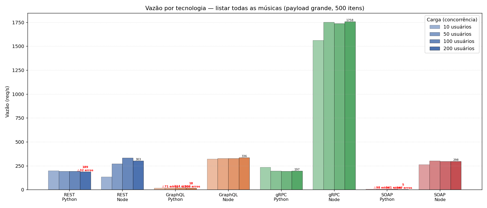

#### Latência p95 por tecnologia (escala logarítmica)

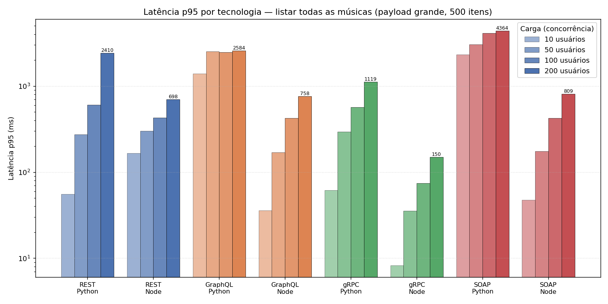

#### Vazão x concorrência (evolução sob aumento de carga)

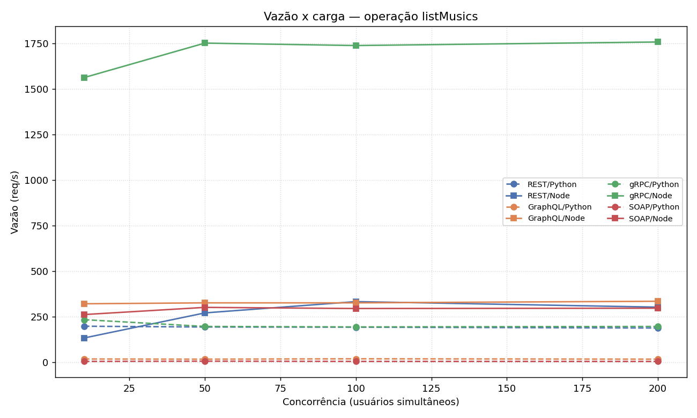

#### Tabela numérica — `listMusics` — Vazão (req/s)

```
Tecnologia       │   c=10  │   c=50  │  c=100  │  c=200
─────────────────┼─────────┼─────────┼─────────┼─────────
Node  / gRPC     │ 1563.0  │ 1752.3  │  1738.9 │  1758.5
Node  / GraphQL  │  321.8  │  326.9  │   326.9 │   335.6
Node  / SOAP     │  262.6  │  302.0  │   295.8 │   297.6
Python/ gRPC     │  234.6  │  197.5  │   194.9 │   197.4
Python/ REST     │  198.6  │  194.3  │   193.4 │   188.9
Node  / REST     │  134.0  │  271.7  │   333.6 │   303.4
Python/ GraphQL  │   18.8  │   17.9  │    19.8 │    17.9  ⚠ erros
Python/ SOAP     │    5.7  │    6.9  │     5.7 │     5.4  ⚠ erros
```

#### Tabela numérica — `listMusics` — Latência média (avg_ms)

```
Tecnologia       │   c=10  │   c=50  │  c=100  │  c=200
─────────────────┼─────────┼─────────┼─────────┼─────────
Node  / gRPC     │    6.4  │   28.4  │   56.9  │  111.8
Node  / GraphQL  │   31.0  │  149.7  │  293.2  │  549.7
Node  / SOAP     │   37.9  │  162.1  │  323.5  │  620.9
Python/ gRPC     │   42.3  │  244.7  │  479.2  │  892.9
Python/ REST     │   50.1  │  248.5  │  482.0  │  879.4
Node  / REST     │   68.5  │  165.8  │  273.5  │  421.7
Python/ GraphQL  │  500.8  │ 1204.6  │ 1202.4  │ 1495.0  ⚠ erros
Python/ SOAP     │ 1633.9  │ 2074.1  │ 2700.1  │ 2987.6  ⚠ erros
```

#### Tabela numérica — `listMusics` — Latência p95 (ms)

```
Tecnologia       │   c=10  │   c=50  │  c=100  │  c=200
─────────────────┼─────────┼─────────┼─────────┼─────────
Node  / gRPC     │    8.2  │   35.5  │   74.3  │  149.7
Node  / GraphQL  │   35.9  │  168.8  │  422.1  │  758.3
Node  / SOAP     │   47.5  │  175.2  │  422.6  │  808.9
Python/ gRPC     │   61.8  │  295.3  │  566.8  │ 1119.0
Python/ REST     │   55.8  │  272.9  │  602.3  │ 2409.6
Node  / REST     │  166.4  │  301.0  │  430.2  │  698.0
Python/ GraphQL  │ 1396.6  │ 2530.4  │ 2475.9  │ 2584.4  ⚠ erros
Python/ SOAP     │ 2311.8  │ 3049.3  │ 4130.6  │ 4363.8  ⚠ erros
```

#### Interpretação dos resultados — `listMusics`

Na operação `listMusics`, o payload é grande porque a resposta contém 500 músicas. Por isso, tecnologias com serialização mais eficiente tendem a se destacar. O melhor desempenho foi obtido pelo gRPC em Node.js, que manteve vazão acima de 1500 req/s em todos os níveis de concorrência e apresentou as menores latências.

O GraphQL em Node.js também teve bom desempenho, ficando próximo ou acima do REST em alguns cenários. Isso mostra que, mesmo tendo um custo adicional de interpretação da query, a implementação em Node.js conseguiu lidar bem com o volume de requisições.

O REST apresentou comportamento estável, principalmente em Python e Node.js, sem erros registrados nas tabelas. Apesar de não ter alcançado a vazão do gRPC, manteve desempenho previsível.

O SOAP em Python foi o pior cenário para payload grande, com baixa vazão e alta latência. Isso ocorre porque o XML usado pelo SOAP é mais verboso, aumentando o custo de processamento e o tamanho das mensagens. Além disso, a implementação Python apresentou erros sob carga, indicando limitação do servidor utilizado no benchmark.

O símbolo ⚠ indica que ocorreram falhas durante os testes daquele cenário. Portanto, os resultados marcados com esse símbolo não devem ser comparados apenas pela vazão ou latência, pois a presença de erros mostra instabilidade na execução.

#### Comparativo por linguagem — Node.js

As quatro tecnologias isoladas no Node.js: permite comparar REST × GraphQL × gRPC × SOAP eliminando a variável da linguagem.

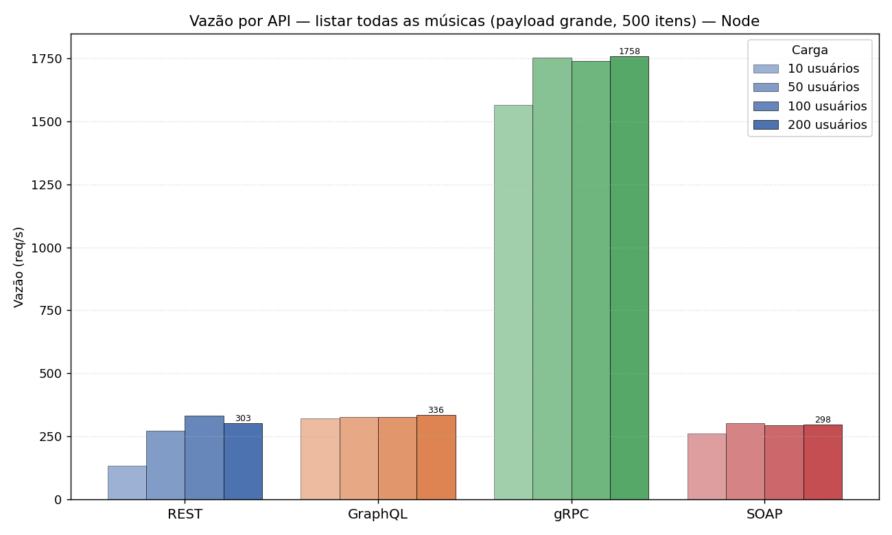

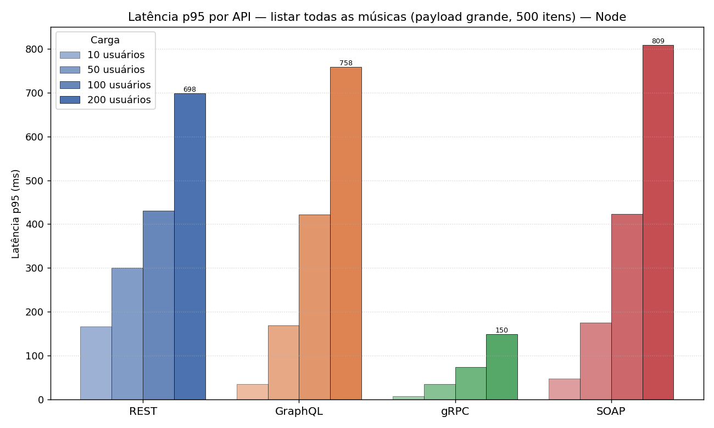

#### Comparativo por linguagem — Python

As quatro tecnologias isoladas no Python: destaca o gargalo do WSGI síncrono no GraphQL e SOAP sob carga alta.

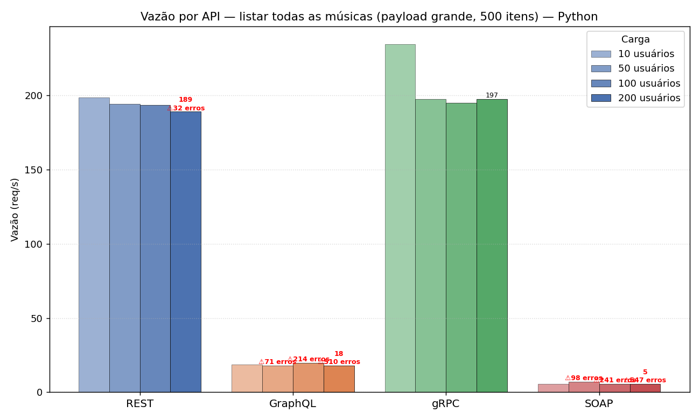

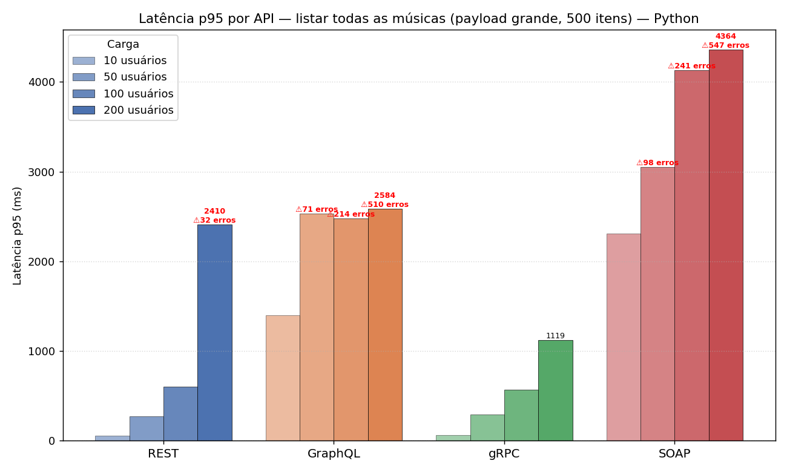

#### Python vs Node — por tecnologia

Cada gráfico isola uma tecnologia e compara diretamente Python contra Node.js nos quatro níveis de concorrência.

##### REST

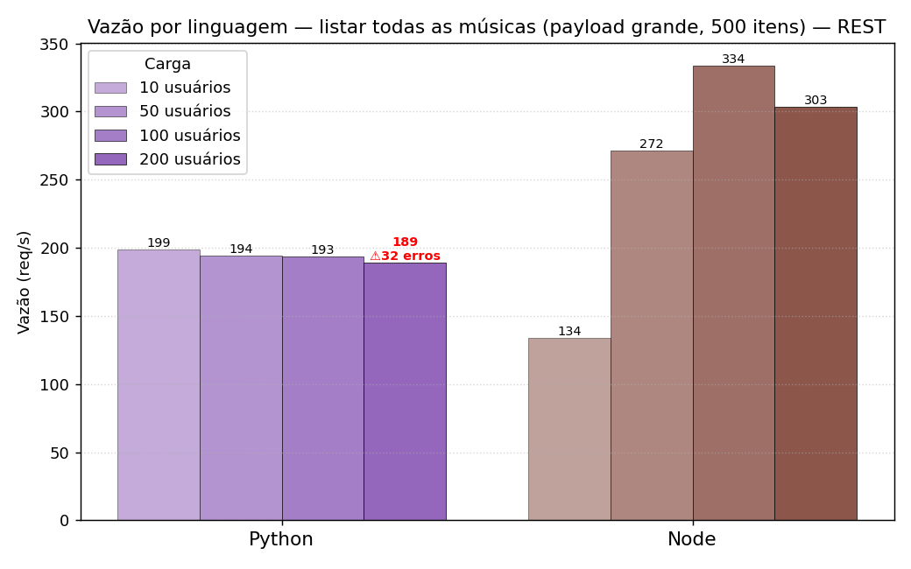

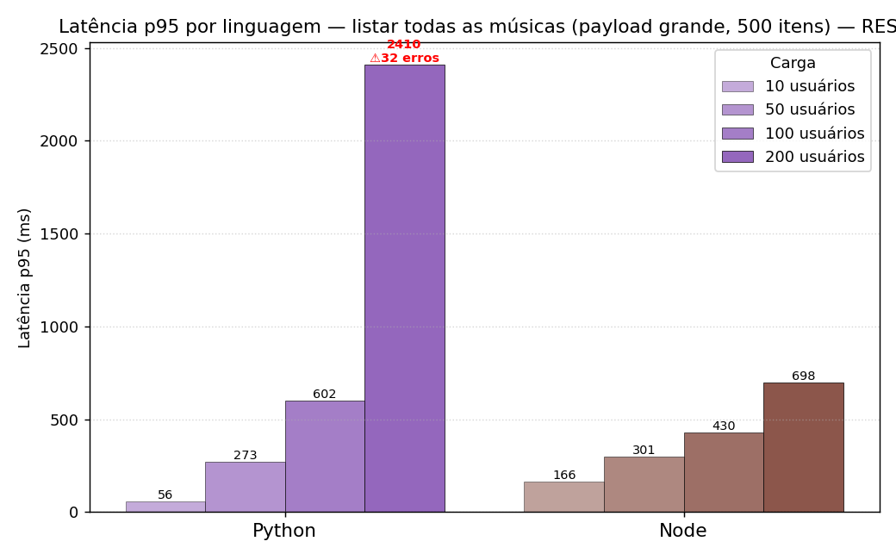

##### GraphQL

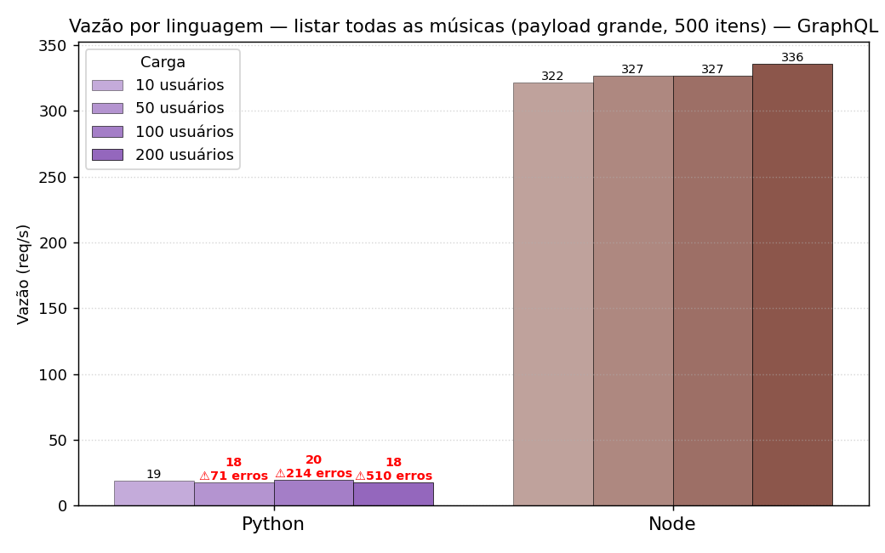

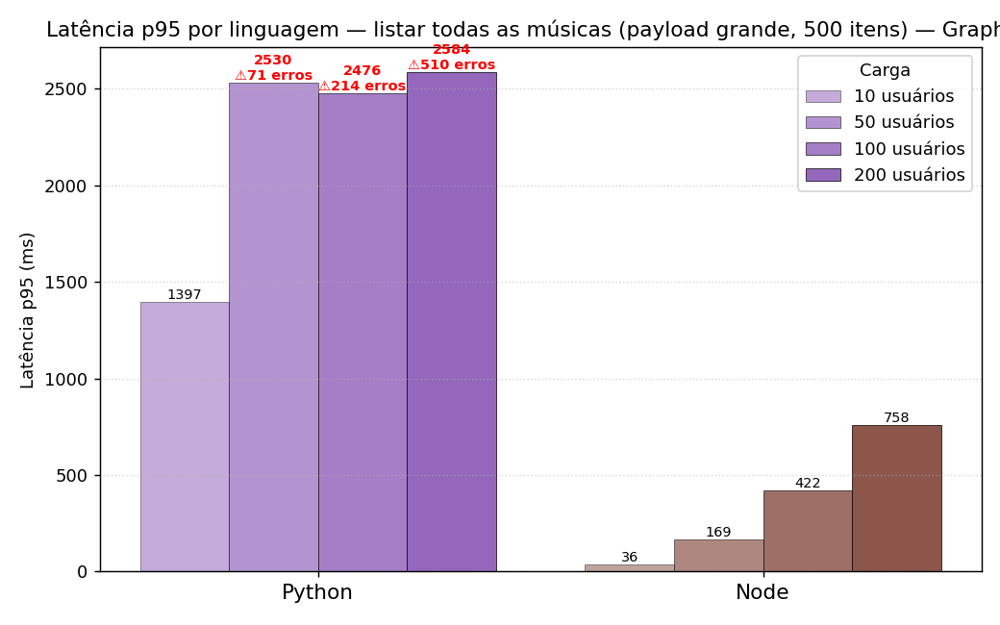

##### gRPC

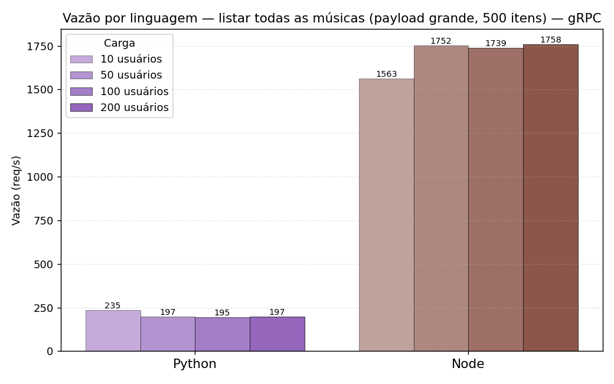

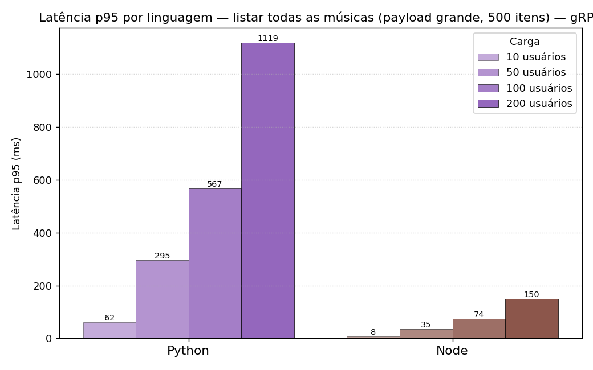

##### SOAP

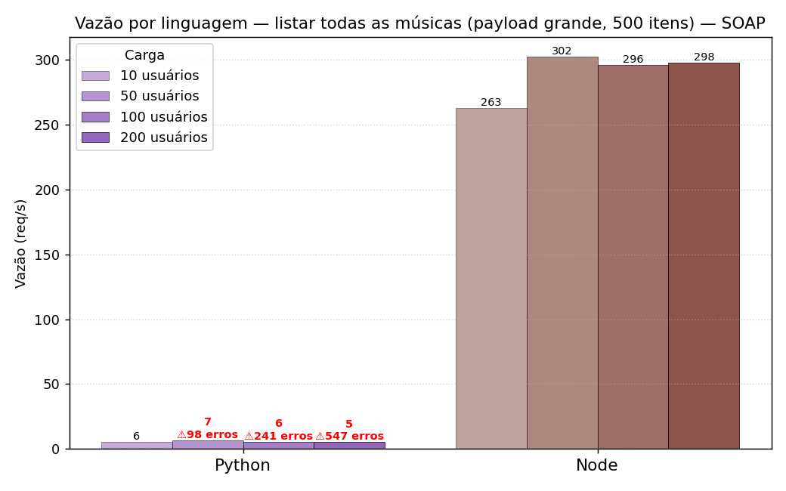

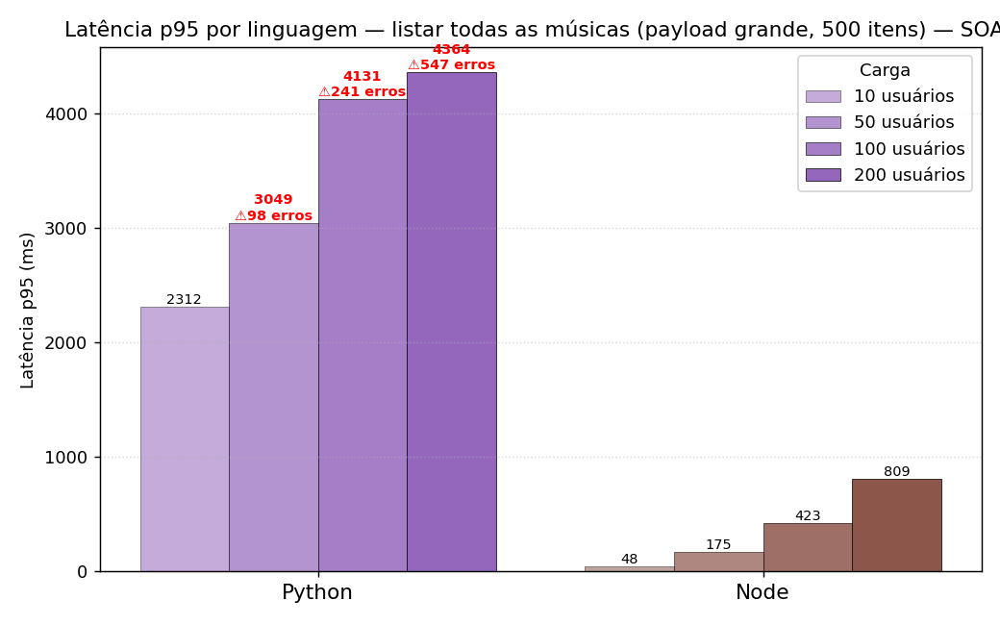

---

### Resultados: `musicsByPlaylist` — payload pequeno (~22 músicas)

#### Vazão por tecnologia (todos os níveis de carga)

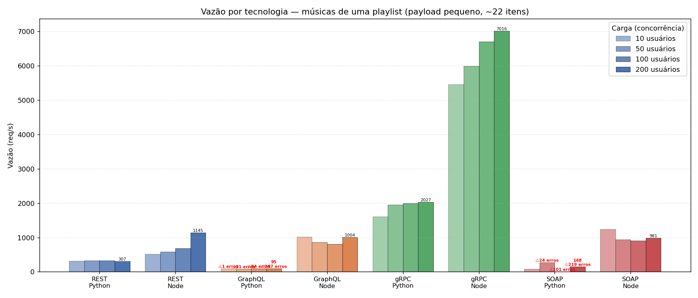

#### Latência p95 por tecnologia (escala logarítmica)

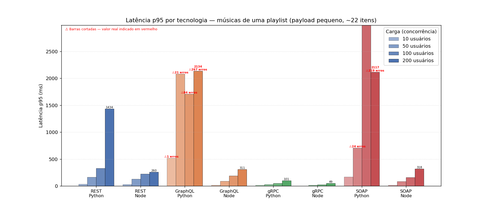

#### Vazão x concorrência (evolução sob aumento de carga)

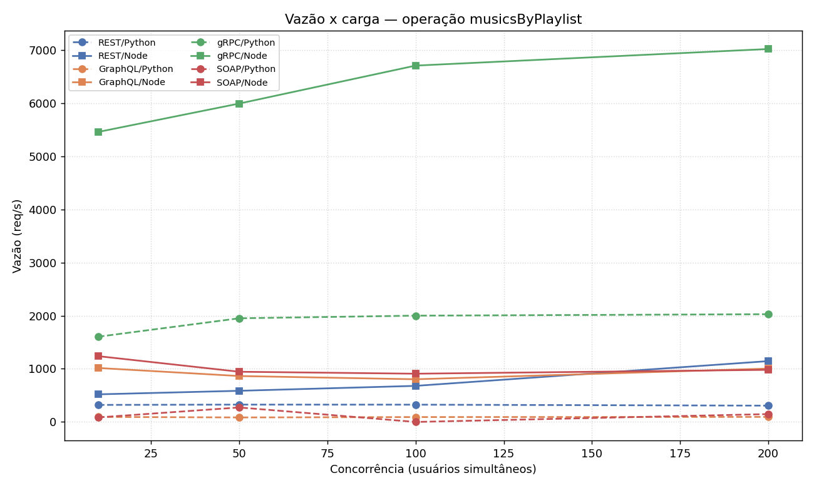

#### Tabela numérica — `musicsByPlaylist` — Vazão (req/s)

```
Tecnologia       │   c=10  │   c=50  │  c=100  │  c=200
─────────────────┼─────────┼─────────┼─────────┼─────────
Node  / gRPC     │ 5455.5  │ 5989.8  │  6703.6 │  7015.7
Python/ gRPC     │ 1603.7  │ 1950.6  │  2000.1 │  2027.0
Node  / SOAP     │ 1238.2  │  944.8  │   907.9 │   980.9
Node  / GraphQL  │ 1015.8  │  864.3  │   803.4 │  1004.4
Node  / REST     │  520.0  │  586.5  │   679.2 │  1144.8
Python/ REST     │  321.1  │  326.4  │   325.4 │   307.1
Python/ GraphQL  │   95.3  │   85.2  │    92.4 │    95.1  ⚠ erros
Python/ SOAP     │   85.7  │  273.2  │     0.4 │   148.1  ⚠ erros
```

#### Tabela numérica — `musicsByPlaylist` — Latência média (avg_ms)

```
Tecnologia       │   c=10  │   c=50  │  c=100  │  c=200
─────────────────┼─────────┼─────────┼─────────┼─────────
Node  / gRPC     │    1.8  │    8.3  │   14.5  │   26.1
Python/ gRPC     │    6.2  │   25.4  │   48.8  │   95.1
Node  / SOAP     │    8.1  │   51.7  │  100.3  │  169.1
Node  / GraphQL  │    9.8  │   56.4  │  113.4  │  162.0
Node  / REST     │   19.1  │   80.2  │  131.9  │  142.2
Python/ REST     │   31.0  │  148.9  │  290.8  │  581.8
Python/ GraphQL  │   95.4  │  426.4  │  646.6  │  921.5  ⚠ erros
Python/ SOAP     │  110.8  │  136.2  │>150000  │  699.0  ⚠ erros
```

#### Tabela numérica — `musicsByPlaylist` — Latência p95 (ms)

```
Tecnologia       │   c=10  │   c=50  │  c=100  │  c=200
─────────────────┼─────────┼─────────┼─────────┼─────────
Node  / gRPC     │    2.6  │   14.5  │   25.1  │   48.7
Python/ gRPC     │   13.8  │   30.7  │   53.0  │  101.4
Node  / SOAP     │   13.5  │   84.8  │  160.6  │  317.9
Node  / GraphQL  │   15.6  │   89.5  │  189.7  │  311.1
Node  / REST     │   33.3  │  128.7  │  223.7  │  260.3
Python/ REST     │   35.5  │  165.8  │  327.9  │ 1433.9
Python/ GraphQL  │  519.8  │ 2079.3  │ 1706.8  │ 2134.2  ⚠ erros
Python/ SOAP     │  170.9  │  706.4  │>2400000 │ 2116.7  ⚠ erros
```

#### Interpretação dos resultados — `musicsByPlaylist`

Na operação `musicsByPlaylist`, o payload é menor, pois a resposta retorna cerca de 22 músicas. Nesse caso, o custo fixo de cada tecnologia fica mais evidente, já que a transferência de dados pesa menos do que em `listMusics`.

O gRPC novamente apresentou o melhor desempenho geral. Em Node.js, alcançou até 7015.7 req/s com concorrência 200, mantendo latência média baixa mesmo sob carga elevada. Isso reforça a vantagem do uso de HTTP/2 e Protocol Buffers em cenários de alta concorrência.

O gRPC em Python também teve bom resultado, ficando acima das demais tecnologias em Python. Isso mostra que a implementação gRPC conseguiu aproveitar melhor a comunicação binária mesmo fora do ambiente Node.js.

Em Node.js, SOAP, GraphQL e REST tiveram desempenhos mais próximos entre si para payload pequeno. O SOAP em Node.js, apesar de teoricamente mais pesado por usar XML, apresentou boa vazão nesse cenário específico. Isso sugere que, para respostas pequenas, o overhead do XML teve impacto menor.

Em Python, REST foi mais estável que GraphQL e SOAP. GraphQL e SOAP apresentaram erros, especialmente sob cargas maiores, indicando que a implementação Python usada no teste não lidou bem com alta concorrência nesses casos.

O resultado extremo do SOAP em Python com concorrência 100, especialmente na latência p95, indica forte instabilidade. Por isso, esse ponto deve ser tratado como anomalia experimental e não como desempenho normal da tecnologia.

#### Comparativo por linguagem — Node.js

As quatro tecnologias isoladas no Node.js: com payload pequeno, gRPC domina, mas SOAP e GraphQL ficam muito próximos do REST.

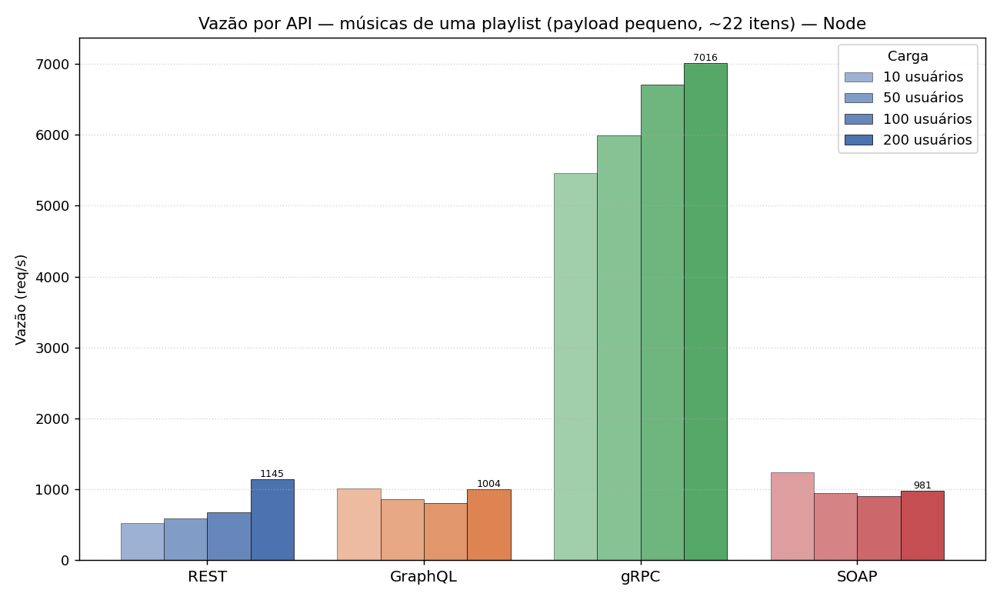

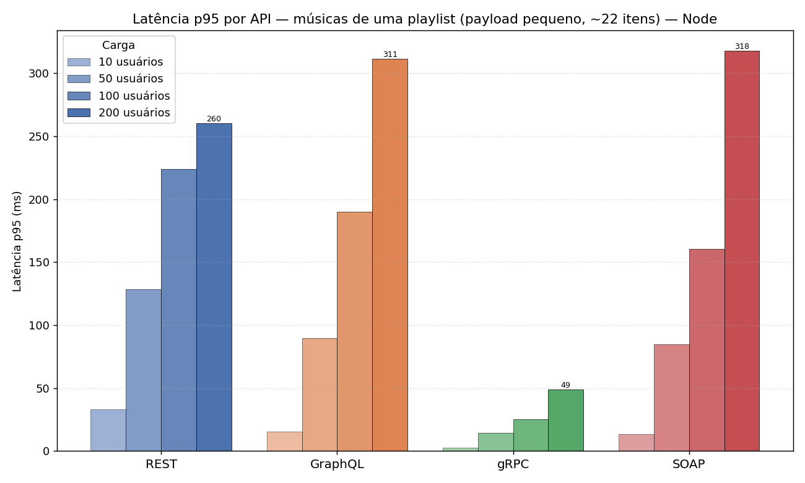

#### Comparativo por linguagem — Python

As quatro tecnologias isoladas no Python: gRPC também lidera, enquanto SOAP e GraphQL mostram instabilidade sob alta concorrência.

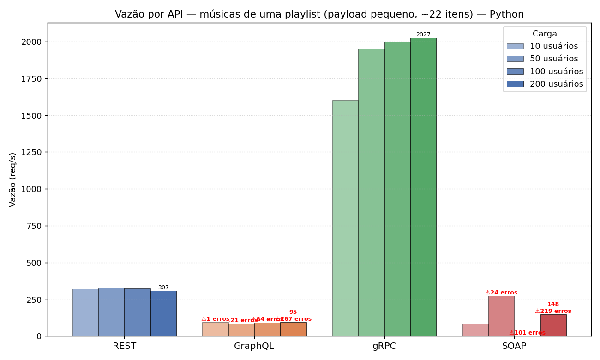

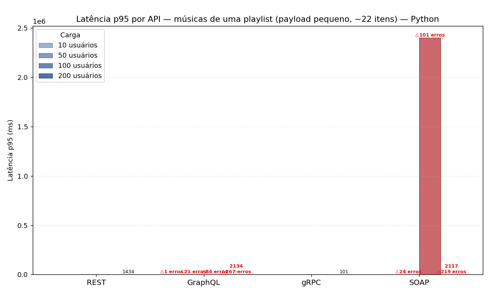

#### Python vs Node — por tecnologia

Cada gráfico isola uma tecnologia e compara diretamente Python contra Node.js nos quatro níveis de concorrência.

##### REST

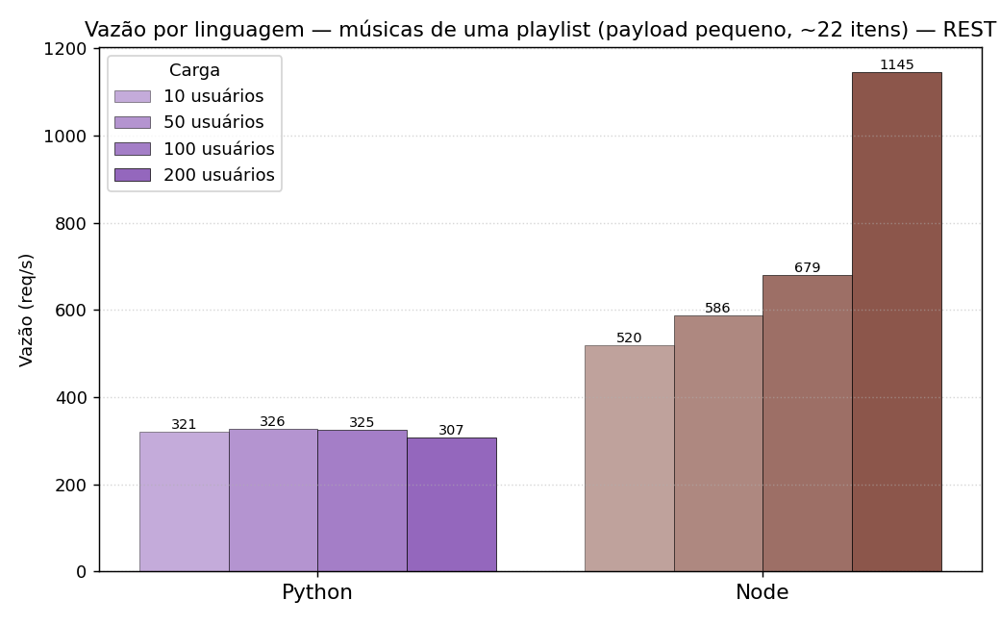

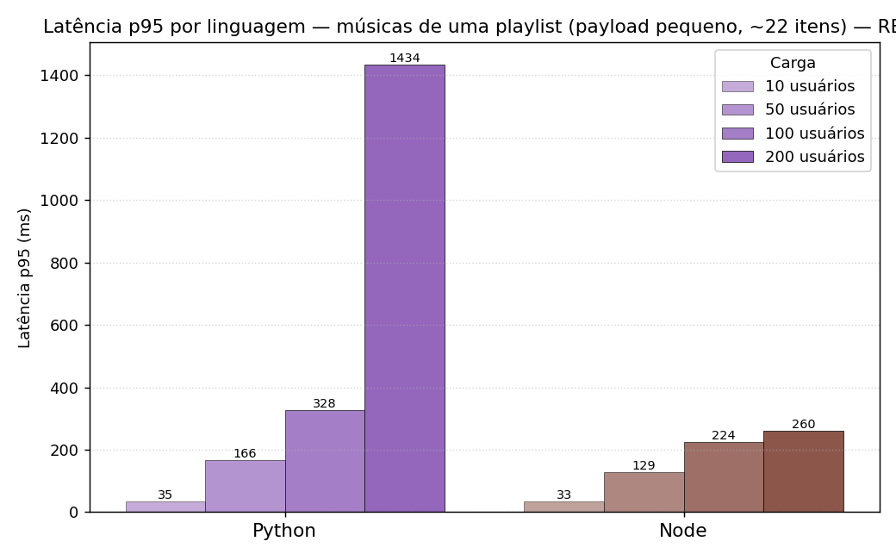

##### GraphQL

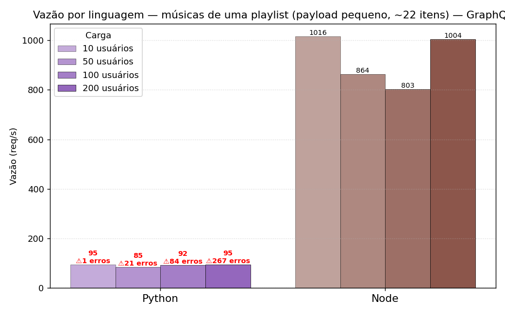

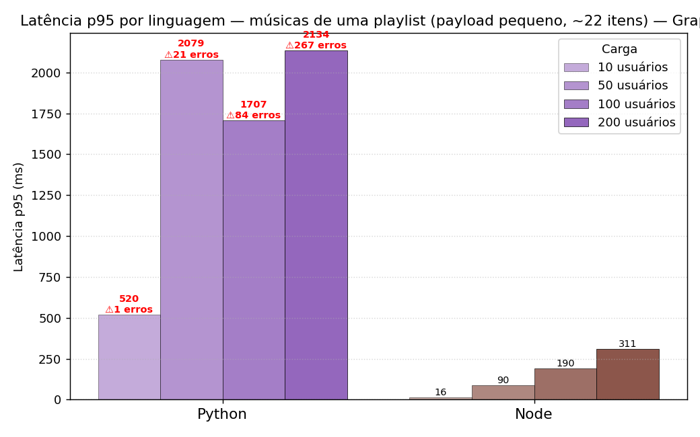

##### gRPC

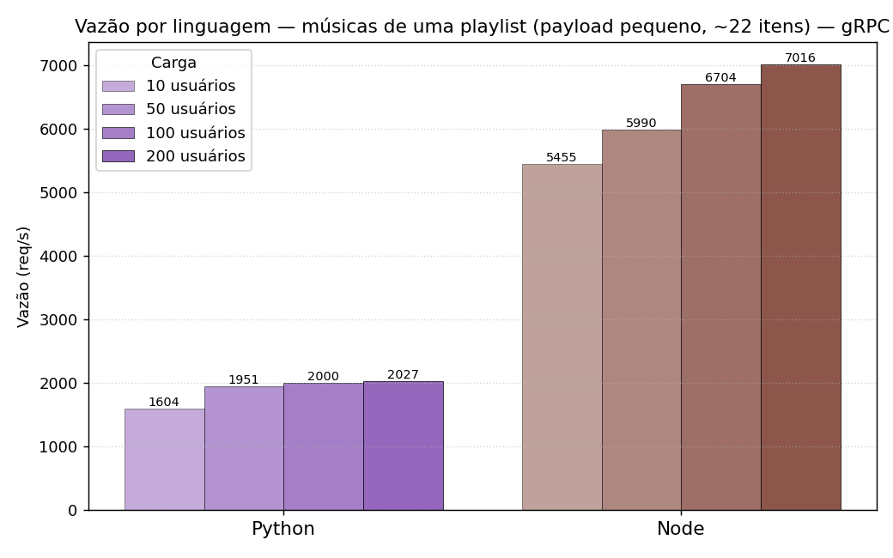

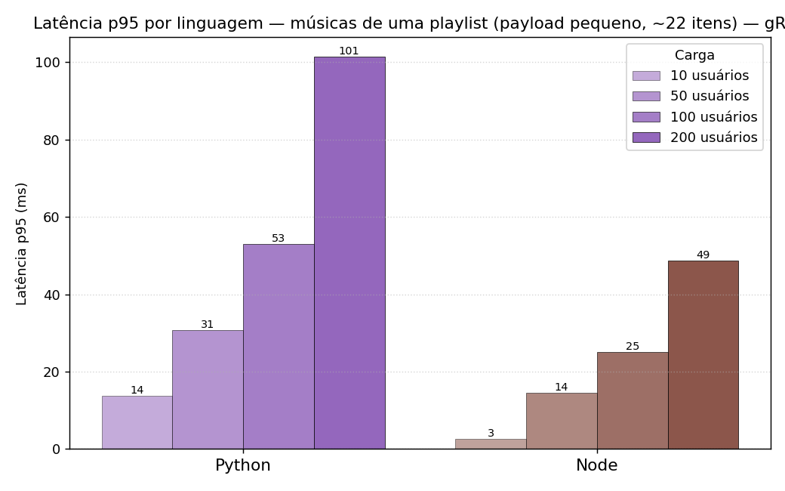

##### SOAP

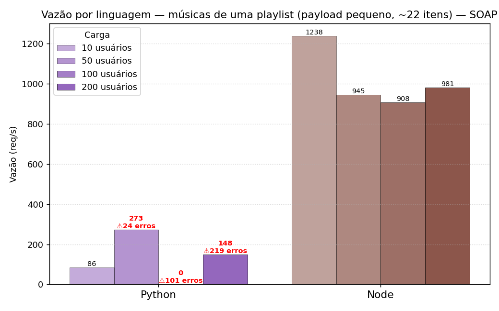

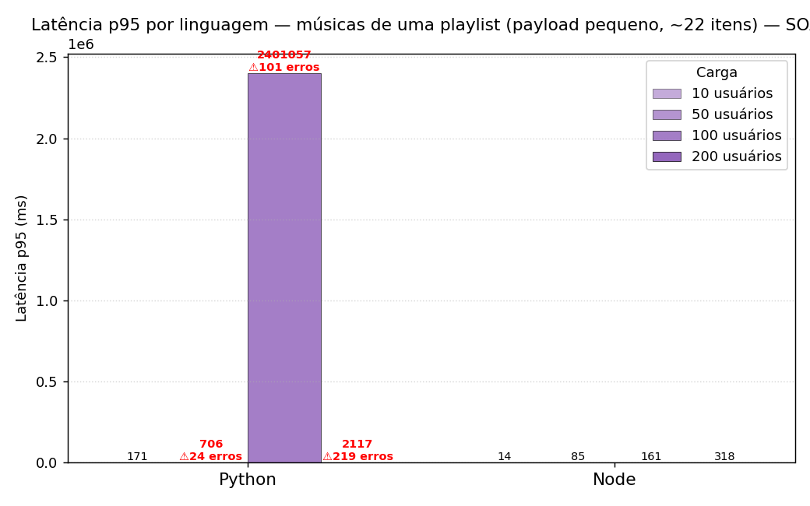

---

## 6. Análise Crítica

### Performance

**gRPC** foi a tecnologia mais rápida nos dois cenários testados. Em `musicsByPlaylist`, com payload pequeno, o gRPC em Node.js alcançou até **7015.7 req/s** com concorrência 200. Em `listMusics`, com payload grande, também liderou, mantendo vazão acima de **1500 req/s** em todos os níveis de carga.

Esse desempenho pode ser explicado principalmente por dois fatores:

1. **Protocol Buffers:** formato binário mais compacto e eficiente que JSON e XML.
2. **HTTP/2:** permite melhor uso da conexão, multiplexação e menor overhead em comparação com abordagens HTTP tradicionais.

**REST** apresentou comportamento consistente e previsível. Em geral, não foi a tecnologia mais rápida, mas demonstrou estabilidade e simplicidade. Isso reforça o motivo de REST ser amplamente utilizado em APIs públicas e aplicações web/mobile.

**GraphQL** teve desempenho competitivo em Node.js, principalmente no cenário de payload pequeno. Porém, no payload grande, o custo de processar queries e resolver campos se torna mais perceptível. Em Python, a implementação com Ariadne apresentou instabilidade sob carga, com erros registrados nos testes.

**SOAP** apresentou desempenho mais limitado, principalmente em Python e no cenário de payload grande. Na operação `listMusics`, o SOAP em Python ficou entre **5.4 e 6.9 req/s**, com latência média entre **1633.9 ms e 2987.6 ms**. Esse resultado está relacionado ao uso de XML, que torna as mensagens maiores e aumenta o custo de serialização e desserialização.

Em Node.js, o SOAP teve resultado melhor do que em Python, especialmente no cenário de payload pequeno. Mesmo assim, por ser mais verboso e menos simples de depurar, SOAP tende a ser menos indicado para APIs modernas quando não há exigência de contrato formal, WS-Security ou compatibilidade com sistemas legados.

### Experiência de desenvolvimento

| Aspecto | SOAP | REST | GraphQL | gRPC |
|---|---|---|---|---|
| Facilidade de implementação | Baixa — geração de WSDL e tipos complexos | Alta — mapeamento direto de recursos | Média — schema SDL + resolvers | Média — .proto + geração de código |
| Depuração | Difícil — XML verboso, ferramentas específicas | Fácil — curl, Postman, browser | Média — GraphiQL facilita | Difícil — payload binário |
| Refatoração | Difícil — mudança no WSDL quebra clientes | Fácil — URLs bem definidas | Fácil — schema é versionável | Média — evolução compatível via field numbers |
| Documentação | Automática via WSDL | Manual (OpenAPI/Swagger) | Automática via introspecção | Automática via .proto |

### Quando usar cada tecnologia?

```
┌──────────────────────────────────────────────────────────────────┐
│  SOAP     → Integrações enterprise, sistemas bancários/legados,  │
│             quando contratos formais e WS-Security são           │
│             obrigatórios (ex.: NF-e, SEFAZ).                    │
├──────────────────────────────────────────────────────────────────┤
│  REST     → APIs públicas, integração web/mobile, recursos bem   │
│             definidos. Escolha padrão pelo tooling maduro e      │
│             familiaridade.                                        │
├──────────────────────────────────────────────────────────────────┤
│  GraphQL  → Frontends com necessidades variadas (mobile vs web), │
│             APIs com muitas relações exploráveis, quando evitar  │
│             overfetching é crítico.                              │
├──────────────────────────────────────────────────────────────────┤
│  gRPC     → Comunicação interna entre microsserviços, sistemas   │
│             onde latência e throughput são críticos, streaming   │
│             de dados em tempo real.                              │
└──────────────────────────────────────────────────────────────────┘
```

### Limitações dos testes

Os resultados obtidos representam o comportamento das implementações neste ambiente específico de teste. Portanto, eles não devem ser interpretados como uma verdade absoluta sobre cada tecnologia.

Alguns fatores podem influenciar os resultados:

- linguagem utilizada;
- biblioteca escolhida para cada tecnologia;
- servidor HTTP utilizado;
- modelo de concorrência de Python e Node.js;
- tamanho do payload retornado;
- tempo de duração do benchmark;
- hardware da máquina onde os testes foram executados.

Além disso, os servidores Python HTTP utilizados nos testes rodam em ambiente de desenvolvimento, o que pode limitar o desempenho sob alta concorrência. Em um ambiente de produção, seria recomendado utilizar servidores como `gunicorn`, `uvicorn` ou `waitress`, dependendo da tecnologia utilizada.

Mesmo com essas limitações, os testes são úteis porque todas as implementações foram comparadas com o mesmo conjunto de dados, as mesmas operações e os mesmos níveis de concorrência.

> **Nota metodológica:** os servidores HTTP em Python utilizados neste projeto rodam com servidores de desenvolvimento, como `wsgiref`, que não são ideais para cenários de alta concorrência. Isso ajuda a explicar os erros observados principalmente em GraphQL e SOAP sob cargas maiores. Em produção, o resultado poderia melhorar com servidores mais robustos, como `gunicorn`, `uvicorn` ou `waitress`. Ainda assim, os testes mostram uma tendência geral consistente: gRPC apresentou a melhor performance, REST foi estável, GraphQL teve bom desempenho em Node.js e SOAP sofreu mais com payloads grandes e XML.

### Conclusão da análise

A partir dos testes realizados, é possível concluir que a escolha da tecnologia de invocação remota depende do objetivo do sistema. Para máxima performance e comunicação interna entre serviços, gRPC foi a melhor opção. Para APIs públicas e de fácil consumo, REST continua sendo uma escolha equilibrada. Para aplicações em que o cliente precisa controlar exatamente os dados retornados, GraphQL é uma alternativa interessante. Já SOAP se mostra mais adequado para contextos corporativos, sistemas legados e integrações que exigem contratos formais e padrões específicos de segurança.

Portanto, não existe uma tecnologia universalmente melhor em todos os casos. A melhor escolha depende de fatores como desempenho esperado, facilidade de desenvolvimento, compatibilidade com clientes, necessidade de contrato formal e tipo de aplicação.

---

## 7. Como Executar

### Pré-requisitos

- Python 3.12+ com virtualenv em `.venv/`
- Node.js 18+

### Instalar dependências

```bash
# Python
.venv/Scripts/python -m pip install -r python/requirements.txt

# Node.js
cd node && npm install
```

### Iniciar um servidor

```bash
# Python
.venv/Scripts/python python/rest/server.py      # REST    → :8001
.venv/Scripts/python python/graphql/server.py   # GraphQL → :8002
.venv/Scripts/python python/grpc/server.py      # gRPC    → :8003
.venv/Scripts/python python/soap/server.py      # SOAP    → :8004

# Node.js
cd node
node rest/server.js      # REST    → :8101
node graphql/server.js   # GraphQL → :8102
node grpc/server.js      # gRPC    → :8103
node soap/server.js      # SOAP    → :8104
```

### Testar manualmente

```bash
# REST — listar músicas
curl http://localhost:8001/musics

# REST — músicas de uma playlist
curl http://localhost:8001/playlists/1/musics

# GraphQL — query
curl -X POST http://localhost:8002/graphql \
  -H "Content-Type: application/json" \
  -d '{"query": "{ musicsByPlaylist(playlistId: 1) { id nome artista } }"}'

# SOAP — WSDL
curl "http://localhost:8004/?wsdl"
```

### Executar testes de carga

```bash
# Benchmark padrão (10, 50, 100 threads, 5s cada)
.venv/Scripts/python loadtest/loadtest.py

# Personalizado
.venv/Scripts/python loadtest/loadtest.py --duration 5 --levels 10 50 100 200

# Gerar gráficos PNG a partir do CSV
.venv/Scripts/python loadtest/plot.py
```

Resultados salvos em `loadtest/results/results.csv`.

---

## 8. Referências

1. W3C. *SOAP Version 1.2 Part 1: Messaging Framework (Second Edition)*. https://www.w3.org/TR/soap12/
2. Fielding, R. T. *Architectural Styles and the Design of Network-Based Software Architectures*. Doctoral Dissertation, University of California, Irvine, 2000. https://www.ics.uci.edu/~fielding/pubs/dissertation/top.htm
3. *REST API Tutorial*. https://restfulapi.net/
4. *GraphQL: A query language for your API*. https://graphql.org/
5. *gRPC: A high performance, open source universal RPC framework*. https://grpc.io/
6. Stowe, M. *XML, SOAP, JSON, REST, GraphQL?*. https://www.slideshare.net/mikestowe/xml-soap-json-rest-graphql
7. Brito, G., Valente, M. T. *REST vs GraphQL: A Controlled Experiment*. In Proc. of the Int. Conf. Software Architecture (ICSA), 2020. https://www.researchgate.net/publication/339413273_REST_vs_GraphQL_A_Controlled_Experiment
